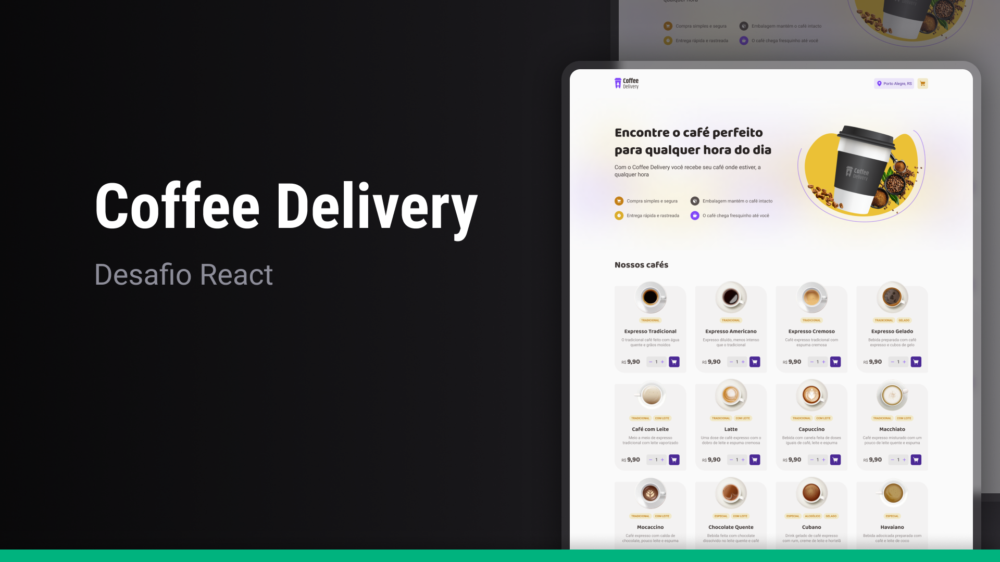

<h1 align="center"> Desafio - Coffee Delivery </h1>

Uma aplicação de e-commerce para uma cafeteria fictícia feita como forma de um desafio do curso ReactJS da Rocketseat

<a href="">🔗 Live Preview</a>&nbsp;&nbsp;&nbsp;|&nbsp;&nbsp;&nbsp;
<a href="#-tecnologias">🚀 Tecnologias</a>&nbsp;&nbsp;&nbsp; |&nbsp;&nbsp;&nbsp;&nbsp;
<a href="#-desafio">💻 Desafio</a>&nbsp;&nbsp;&nbsp;|&nbsp;&nbsp;&nbsp;
<a href="#-aprendizados">📚 Aprendizados</a>

## 🚀 Tecnologias

Esse projeto foi desenvolvido com as seguintes tecnologias:

- React
- Typescript
- HTML e CSS

## 💻 Desafio

O "Coffee Delivery" foi um desafio do curso de ReactJS da Rocketseat no módulo "Hooks". Onde consolidei conhecimentos sobre Context API para estado global, estados, imutabilidade, componentização  e métodos de array (como `reduce`).

## 📚 Aprendizados

Este projeto foi feito como forma de um desafio dentro do curso de ReactJS no módulo "Hooks" da Rocketseat. Nele pude consolidar os conhecimentos sobre:

### React
- Hooks
- Context API
- Imutabilidade do estado
- Componentização
